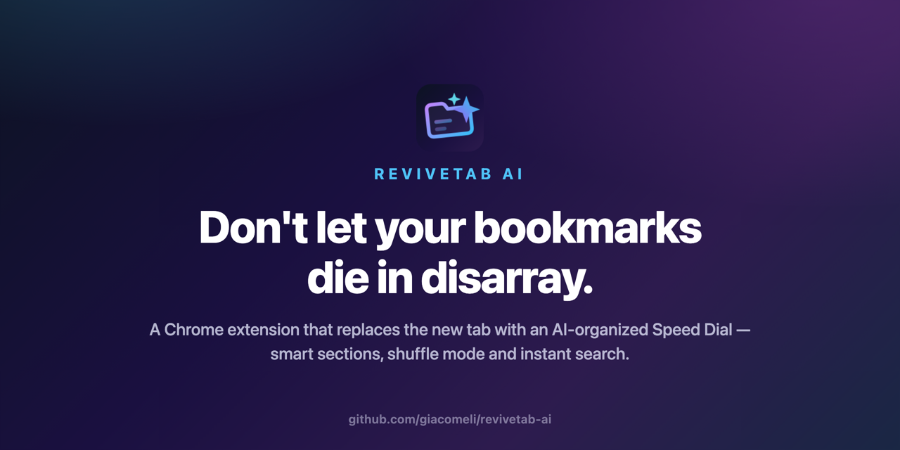

<p align="center">
  
</p>

<h1>ReviveTab AI</h1>

<p><strong>Don't let your bookmarks die in disarray.</strong></p>


Do you also pile up hundreds of bookmarks that fall into oblivion and never get opened again?
ReviveTab AI replaces the New Tab page with a dynamic, intelligent Speed Dial: AI organizes your
links into sections automatically, and every new tab becomes a touchpoint with everything you have
saved over the years. Say goodbye to the "link graveyard".

## Features

- **Smart organization with AI** — connect your API key (DeepSeek or OpenRouter, with model
  selection) and recategorize hundreds of bookmarks into logical sections, with a preview before
  applying and an undo button.
- **Speed Dial with infinite carousels** — a visual, fluid and customizable new tab.
- **Shuffle mode** — forgotten bookmarks show up randomly in each section; the best way to
  revisit what you saved.
- **YouTube player in a modal** — bookmarked videos play right on the new tab.
- **Productivity** — drag-and-drop between sections, customizable sections (name, icon, color,
  order), instant search and layout backup/export.
- **Safe by default** — your browser's folder structure is never changed; the only writes to
  `chrome.bookmarks` are rename and delete, always triggered by your explicit action.

## Installation

**Chrome Web Store:** coming soon.

**Developer mode (any Chromium browser):**

1. `npm install && npm run build`
2. Open `chrome://extensions` (or `brave://extensions`) and enable Developer Mode
3. "Load unpacked" pointing to the `dist/` folder
4. Open a new tab

## Development

Stack: strict TypeScript, Vite + @crxjs/vite-plugin, TailwindCSS + daisyUI, Vitest. Layered
architecture with one-way dependencies (`ui/` -> `services/` -> `data/`).

```bash
npm run dev              # dev server with HMR (writes to dist/)
npm run build            # production build
npm run typecheck        # tsc --noEmit (strict)
npm test                 # Vitest suite
```

## Contributing

Contributions are welcome — bug reports, feature ideas, code and translations.

- **Found a bug or have an idea?** [Open an issue](https://github.com/giacomeli/revivetab-ai/issues)
  describing the behavior (and steps to reproduce, for bugs).
- **Code:** fork the repo, create a branch, and open a pull request. Before submitting, make sure
  `npm run typecheck` and `npm test` pass. Follow the layered architecture
  (`ui/` -> `services/` -> `data/`) — dependencies only point downwards.
- **Translations:** the extension ships in English, Spanish and Brazilian Portuguese. Adding a new
  language is a great first contribution: copy `_locales/en/` to your locale folder (e.g.
  `_locales/fr/`) and translate the strings.
- **One invariant to respect:** the user's bookmark folder structure is never modified. The only
  writes to `chrome.bookmarks` are rename and delete, always triggered by an explicit user action —
  pull requests that break this rule won't be merged.

## Privacy

Your data stays in your browser. The AI API key is stored locally, and bookmark titles/URLs are
only sent to the provider you configured, and only when you trigger the AI organization. No
analytics, no first-party servers. Full policy in [PRIVACY.md](PRIVACY.md).

## License

[MIT](LICENSE)
