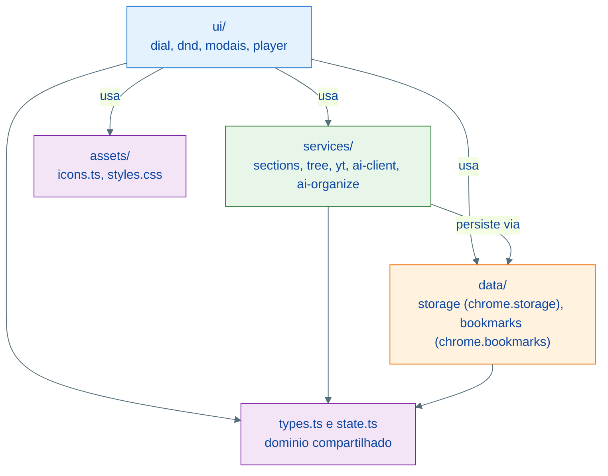

# Spec: Refatoração completa para TypeScript com arquitetura em camadas

- **Data:** 08-07-2026
- **Branch:** `main`
- **Status:** Executado

Nota de processo: o usuário autorizou autonomia total ("pode tomar todas as decisões até concluir o
projeto"), então os checkpoints de aprovação entre fases foram dispensados nesta execução. O estado
anterior foi commitado a pedido do usuário em `150bd65`.

## Contexto

O projeto cresceu de um script único para 16 módulos ES em JavaScript puro, todos achatados em `src/`.
Sem tipos, os contratos entre módulos (shape de `Bookmark`, `Section`, `AiConfig`, respostas da API)
vivem só em comentários e na disciplina de quem edita. A refatoração migra tudo para TypeScript
estrito e organiza o código em camadas com dependência unidirecional (UI -> services -> data), sem
nenhuma mudança de comportamento.

## Arquitetura alvo

Estrutura de arquivos alvo (mapeamento 1:1 com os módulos atuais):

| Camada | Arquivo alvo | Origem |
| --- | --- | --- |
| raiz | `src/main.ts` | `src/main.js` |
| raiz | `src/state.ts` | `src/state.js` (estado runtime + instrumentação) |
| raiz | `src/types.ts` | novo — tipos de domínio (`Bookmark`, `Section`, `Membership`, `Meta`, `AiConfig`, `TreeNode`, resultados de organize/preview) |
| assets | `src/assets/icons.ts` | `src/icons.js` |
| assets | `src/assets/styles.css` | `src/styles.css` |
| data | `src/data/storage.ts` | `src/storage.js` |
| data | `src/data/bookmarks.ts` | novo — adaptador promisificado de `chrome.bookmarks` (getTree, updateTitle, remove, listeners), extraído de `dial.js`/`bookmark-ops.js` |
| services | `src/services/sections.ts` | `src/sections.js` |
| services | `src/services/tree.ts` | `src/tree.js` |
| services | `src/services/yt.ts` | `src/yt.js` |
| services | `src/services/ai-client.ts` | `src/ai-client.js` |
| services | `src/services/ai-organize.ts` | `src/ai-organize.js` |
| ui | `src/ui/dial.ts` | `src/dial.js` |
| ui | `src/ui/dnd.ts` | `src/dnd.js` |
| ui | `src/ui/modal.ts` | `src/modal.js` |
| ui | `src/ui/modal-sections.ts` | `src/modal-sections.js` |
| ui | `src/ui/modal-ai.ts` | `src/modal-ai.js` |
| ui | `src/ui/video-modal.ts` | `src/video-modal.js` |
| ui | `src/ui/bookmark-ops.ts` | `src/bookmark-ops.js` |

## Requisitos

1. **TypeScript estrito em todo o código-fonte e testes.** `tsconfig.json` com `strict: true`,
   `noEmit`, `moduleResolution: bundler`, libs DOM + ES2022, tipos do Chrome via `@types/chrome`.
   Novo script `npm run typecheck` (`tsc --noEmit`). Vite/@crxjs e Vitest transpilam TS nativamente —
   sem mudança no pipeline de build.
2. **Camadas com dependência unidirecional.** `ui/` pode importar de `services/`, `data/`, `assets/`,
   `state`, `types`; `services/` só de `data/` e `types`; `data/` só de `types`. Nenhum import de
   `ui/` a partir de camadas inferiores (o padrão `registerRenderer` já garante isso e é mantido).
3. **Adaptador `data/bookmarks.ts`.** Todo acesso a `chrome.bookmarks` sai da UI: `getTree()`
   promisificado, `updateTitle(id, title)`, `removeBookmark(id)`, `onRemoved/onCreated/onChanged`.
   `dial.ts` e `bookmark-ops.ts` passam a consumi-lo.
4. **Tipos de domínio centralizados em `types.ts`** e usados nas assinaturas públicas de todos os
   módulos; zero `any` fora de fronteiras estritamente necessárias (respostas JSON externas são
   validadas e tipadas no parse).
5. **Testes migrados para TS** (`test/*.test.ts`) importando dos novos caminhos, sem perda de casos
   (54 testes atuais).
6. **Comportamento idêntico.** Nenhuma mudança funcional, de UI, de storage schema ou de manifest
   (exceto versão). Classes CSS estruturais (`bd-*`, `dial-*`) intactas. Versão `3.3.0` -> `3.4.0`.
7. **Documentação.** `CLAUDE.md` atualizado (stack, comandos com typecheck, tabela de módulos por
   camada, regra de dependência entre camadas).

## Restrições

- Não introduzir framework de UI, bundler novo ou dependência de runtime — só `typescript` e
  `@types/chrome` como devDependencies.
- Não renomear identificadores públicos, chaves de storage, ids/classes de DOM nem strings de UI.
- Não "aproveitar" para otimizar lógica — refatoração estrutural pura; qualquer bug encontrado é
  reportado, não corrigido em silêncio (vai para follow-up).
- `vite.config.js`, `tailwind.config.js` e `postcss.config.js` permanecem em JS (config de build,
  fora do escopo do typecheck).
- Não commitar (o commit do estado anterior já foi feito a pedido; um novo commit só com pedido
  explícito).

## Arquivos Envolvidos

Além da tabela de mapeamento acima: `package.json` (deps + scripts + versão), `tsconfig.json` (novo),
`index.html` (entry `/src/main.ts`), `manifest.json` (versão), `test/*.test.ts` (4 arquivos),
`CLAUDE.md`.

## Critérios de Sucesso

- [x] `npm run typecheck` sem erros (strict).
- [x] `npm test` verde com os mesmos 54 casos (agora em TS).
- [x] `npm run build` gera `dist/` funcional (manifest 3.4.0). Nota: o build expôs que o `content`
      do Tailwind não incluía `.ts` — CSS caiu de 69,5 kB para 18,4 kB; corrigido o glob e o CSS
      voltou ao tamanho original (armadilha registrada no CLAUDE.md).
- [x] `find src -name "*.js"` vazio — nenhum JS remanescente no código-fonte.
- [x] Nenhum import de `ui/` dentro de `services/` ou `data/` (grep).
- [x] Nenhum `any` explícito em `src/` (grep `: any`).
- [x] Extensão carregada manualmente sem regressão visível (dial, busca, DnD, modais, player, IA)
      — validado pelo usuário em 08-07-2026.
